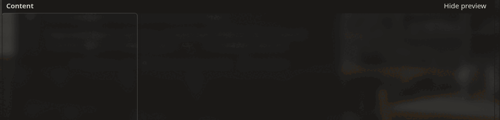

# World Info Workspace

One place for your lore in **SillyTavern**: a folder tree of any depth, kept in sync with
real World Info books, with a markdown folder on disk and an AI lore assistant attached to
the same tree.


> Replaces the native Worlds/Lorebooks editor while it is enabled — the native editor is
> always one button away, and nothing is converted until you ask for it.

## What it does

- **Organises lore as a tree.** Folders, lore entries and images, nested however you like.
  Multi-select for bulk actions, drag to move, long press on touch devices.
- **Turns any folder into a real lorebook.** Everything beneath it is flattened into one
  native World Info book and pushed automatically as you edit — no export step.
- **Writes and reads markdown folders.** Export a subtree, import a vault, or link one
  folder for continuous two-way sync. Obsidian vaults work as they are.
- **Puts an AI assistant next to the tree.** It proposes entries, edits and
  reorganisations; nothing is applied until you accept it, and any batch can be undone.
- **Keeps every native field.** Keys, strategy, order, position, depth, role, character
  filters, triggers — the full World Info entry, grouped so the common fields are up front.

<table>
  <tr>
    <td></td>
    <td></td>
  </tr>
  <tr>
    <td align="center">A folder bound to a native book</td>
    <td align="center">Proposals wait for you</td>
  </tr>
</table>

## Install

In SillyTavern: **Extensions → Install extension**, and paste

```
https://github.com/Alamion/SillyTavern-WorldInfo-Workspace
```

Reload the page, open the **World Info** drawer, and press **Workspace** in the book row.
The workspace header has a **Worlds/Lorebooks** button that switches back at any time.

## The tree

Three kinds of item, nested to any depth:

| Item | What it is |
| --- | --- |
| **Folder** | Organises everything else. Can be designated a World Info root. |
| **Entry** | A lore card — every native World Info field, editable. |
| **Image** | A picture with a caption, for your own reference. |

Edits are saved as you make them. **Images and folders are workspace-only:** they are never
written into a World Info book and never come back from one, because books have no concept
of either.

### Writing with live preview

The content field is markdown, rendered as you type — headings, emphasis, lists, tables,
callouts, and Obsidian-style `[[wikilinks]]` and `![[embeds]]` that resolve against your own
tree.



## World Info sync

A folder becomes a real lorebook when you designate it a **World Info root**.

- The book is created immediately and left **inactive**. Activate it from the Lorebooks
  panel when you want it in play.
- Everything beneath the folder, at any depth, is flattened into that one book.
- The workspace is the source of truth. Edits are pushed about a second after you stop
  typing, and always before a message is generated.
- The book's **name is fixed when it is created**. Renaming the folder later does not
  rename the book — the name is just a handle.
- Moving an entry out removes it from the book on the next sync; moving one in adds it.
- Deleting tells you first exactly what will disappear from which book.

Changes made outside the workspace merge in silently when they do not collide. If the same
entry changed on both sides you get a conflict banner and decide. If a save fails, a banner
offers **Retry** and nothing is lost.

<table>
  <tr>
    <td></td>
    <td valign="top">
      <b>The Lorebooks panel</b><br><br>
      Every native book in one list: activate globally or per character and chat, import one
      into the tree, update it from native, or delete it. Search, filters and paging for
      large libraries.
    </td>
  </tr>
</table>

## Markdown folders

Export any subtree to markdown, import any markdown folder, or link **one** folder for
continuous two-way sync.

- A directory is a folder, a `.md` file is an entry, image files are image items.
- Entry fields live in YAML front matter under `wi_`-prefixed keys; the body below is your
  prose, kept verbatim.
- Every key is optional, defaults are never written, and keys the convention does not own —
  your own front matter, unknown `wi_*` keys — survive the round trip.

While linked, workspace edits are written to disk automatically and disk changes are pulled
in when you open the workspace or press Sync. If both sides changed the same item you
choose per item: keep workspace, keep file, or skip. Deletions on disk are confirmed before
anything is removed.


**Linking needs a desktop Chromium-based browser on a secure page** (`https://` or
`localhost`), because it uses the File System Access API. Elsewhere the control is disabled
and says so — one-off export and import still work everywhere.

## The AI assistant

The assistant writes and reorganises lore with you, using the connection profile you pick in
its settings.

**Nothing is applied until you accept it.** Each proposal can be reviewed as a diff, edited
before accepting, accepted with the rest, or denied. Any applied batch can be undone while
the conversation exists. Deletions and heavy content removals always ask separately and are
never part of "Accept all".

You choose what it sees — the selected items, the whole structure, the current chat, the
character card — and that choice becomes the default for new conversations. Conversations
live in your browser, per profile, never in your settings.

It needs the Connection Manager extension and at least one
[connection profile](https://docs.sillytavern.app/usage/core-concepts/connection-profiles/).
Free models are rate-limited often; the assistant retries by itself and tells you what
happened.

## For extension authors

Other extensions can observe the workspace through documented, namespaced events — tree
changes, native book push outcomes, World Info root designation, workspace visibility:

```js
const { eventSource } = SillyTavern.getContext();
eventSource.on('wi-workspace:tree-changed', ({ changes }) => {
    // [{ change: 'create' | 'delete' | 'move' | 'rename' | 'update', node: {...} }]
});
```

Full reference, payloads and stability promise: **[docs/hooks.md](docs/hooks.md)**.

## Troubleshooting

| Symptom | Cause |
| --- | --- |
| The markdown control is greyed out | Not desktop Chromium, or the page is not secure. One-off export/import still work. |
| The assistant cannot send | The Connection Manager extension is missing, or no profile is selected in the assistant's settings. |
| A book shows a conflict banner | The same entry changed in the workspace and outside it. Open the banner to compare and pick a side. |
| "Workspace data could not be loaded" | The settings payload could not be read. The workspace stays empty and your stored data is untouched until you edit — use **Restore** in the banner. |

## Building from source

```bash
pnpm install
pnpm run build      # production bundle to dist/index.js
pnpm run dev        # watch mode
pnpm run test       # Vitest suite, then the performance budgets
pnpm run lint
pnpm exec tsc --noEmit
```

The built bundle is committed, because `manifest.json` points at `dist/index.js`.

## Credits

- **[SillyTavern](https://github.com/SillyTavern/SillyTavern)** — the host application.
  Everything here runs through its public extension API (`getContext()`): World Info
  loading and saving, connection profiles, popups, events and image storage. No app
  internals are forked or patched.
- **[SillyTavern-3DDiceRolls](https://github.com/Alamion/SillyTavern-3DDiceRolls)** — the
  structural baseline for this extension: React + Webpack + SCSS with theme variables, the
  settings and logging modules, and the single-bundle manifest layout.
- **[SillyTavern-WorldInfoDrawer](https://github.com/LenAnderson/SillyTavern-WorldInfoDrawer)**
  by LenAnderson — the drawer-based lore editor this project learned from, including
  re-binding the native World Info entry point so the editor opens in place.
- **[SillyTavern-WorldInfo-Recommender](https://github.com/bmen25124/SillyTavern-WorldInfo-Recommender)**
  by bmen25124 — the AI lore-suggestion workflow that the in-workspace assistant
  generalises: propose first, apply only on confirmation.
- **[Font Awesome 6 Free](https://fontawesome.com/)** — icons, the same set the host app
  uses, so the workspace matches your theme.
- **[Spec Kit](https://github.com/github/spec-kit)** — the spec-driven workflow this
  project is built with; every increment lives under `specs/`.

## License

[MIT](LICENSE).
